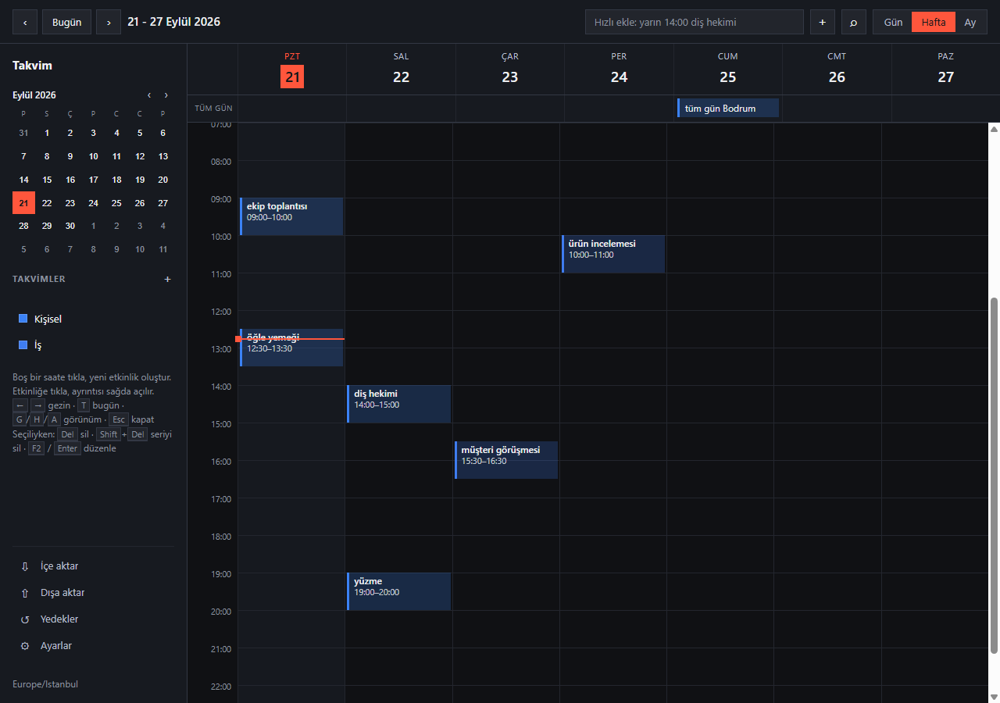

# Takvim

[](https://github.com/tungarix/takvim/actions/workflows/ci.yml)
[](https://github.com/tungarix/takvim/releases/latest)
[](LICENSE)

Bağımsız masaüstü takvim uygulaması. Yerel-öncelikli, tek kullanıcı, çevrimdışı.



**Durum:** v1 tamamlandı. Masaüstündeki **Takvim** kısayolu tek dosyalık
`Takvim.exe`'yi çalıştırır — Python kurulumu gerekmez.

> Kodlama ajanıyla çalışıyorsan önce [AGENTS.md](AGENTS.md) oku.

---

## 1. Kapsam

**Kapsam içi**

- Gün / hafta / ay görünümleri
- Tek seferlik, tekrarlı ve tüm gün etkinlikler
- Tekrarlı serilerde tek örnek silme/kaydırma (override)
- Birden çok takvim (Ders, Kişisel, Aktenak…) — renk ve görünürlük kontrolü
- `.ics` içe aktarma
- Yerel SQLite, tek kullanıcı, çevrimdışı
- Türkçe / İngilizce arayüz dili (⚙ Ayarlar → Dil; varsayılan Türkçe)

**Bilinçli olarak kapsam dışı (v1)**

- Sunucu, hesap, çoklu cihaz senkronu
- Katılımcı / davet / RSVP akışı
- Mobil
- CalDAV

> Kapsam dışı listesi olmayan proje, kapsamı sonsuz projedir. Bu listeyi kısaltmak
> bir karardır; sessizce büyütmek değildir.

---

## 2. Mimari kuralı

```
core/     saf mantık — DB ve GUI bilmez          ✓ Faz 0
store/    kalıcılık (SQLite)                      ✓ Faz 1
ics/      içe/dışa aktarma                        ✓ Faz 2 + 5
ui/       arayüz (yerel web)                      ✓ Faz 3 + 4
remind/   hatırlatıcı (ayrı süreç)               ✓
```

**`core/` hiçbir zaman `store/` veya `ui/` import etmez. Tersi serbest.**

Bu tek kural, ileride bu motoru başka bir uygulamaya (ör. life OS) taşımayı
mümkün kılan şey. Ayrı uygulama yapıyoruz ama kapıyı kapatmıyoruz.

---

## 3. Faz 0'da ne var

| Dosya | Sorumluluk |
|---|---|
| `core/timeutil.py` | UTC ↔ yerel dönüşümlerin tek doğruluk kaynağı |
| `core/models.py` | `Calendar`, `Event`, `Override`, `Occurrence` — frozen, kendi kendini doğrulayan |
| `core/recurrence.py` | `expand(event, overrides, window) -> [Occurrence]`, `series_end(event)` |
| `core/layout.py` | `layout(occurrences) -> [(occurrence, kolon, kolon_sayısı)]` |
| `core/query.py` | `overlaps`, `conflicts`, `free_slots` |

### Öğrenilen üç şey

**1. Tekrar genişletmesi UTC'de değil, etkinliğin kendi saat diliminde yapılır.**
"Her gün 09:00" DST geçişinde 09:00 kalmalı. UTC'de genişletirsen sessizce
kayar — ve Türkiye'de DST olmadığı için yerel testlerde hiç görünmez. Testler
bu yüzden `America/New_York` kullanıyor.

**2. Pencere sorgusu, etkinlik süresi kadar geriye genişletilmeli.**
23:00–01:00 etkinliği, ertesi günün penceresinde de görünmeli. `between(pencere_başı, …)`
demek onu kaybetmek demek; `between(pencere_başı − süre, …)` gerekiyor.

**3. Override bir örneği pencere dışına taşıyabileceği gibi içine de sokabilir.**
Yalnızca pencerede üretilen örneklere override uygulayan bir kod, ikinci yönü
sessizce kaçırır.

Bu üçünün de testleri mutasyonla doğrulandı: ilgili satır bozulduğunda test
kırmızıya dönüyor.

### Kasıtlı davranış kararları

- **31 Ocak + `FREQ=MONTHLY` → Şubat atlanır**, ayın sonuna çekilmez (RFC 5545
  ve dateutil davranışı). "Ayın son günü" isteniyorsa `BYMONTHDAY=-1` ayrı bir
  kuraldır.
- **Yarı açık aralık** `[start, end)`: bitişi tam pencere başına denk gelen
  etkinlik içeride sayılmaz. Gün görünümlerinin birbirine sızmaması buna bağlı.
- **`all_day` doğrulaması yerel gece yarısı üzerinden** yapılır, UTC süresi
  üzerinden değil: DST'li bir dilimde bir tam gün 23 veya 25 saat sürer.
- **Materialize edilmiş occurrence cache tablosu YOK** — performans ölçülene
  kadar da olmayacak. Erken optimizasyon burada tutarlılık kâbusuna dönüşür.

---

## 4. Faz 1'de ne var

| Dosya | Sorumluluk |
|---|---|
| `store/schema.sql` | Güncel şemanın okunabilir anlık görüntüsü (referans) |
| `store/migrations/001_initial.sql` | Şemanın kaynağı; `PRAGMA user_version` ile takip |
| `store/migrator.py` | Bekleyen adımları sırayla, her biri kendi transaction'ında uygular |
| `store/repo.py` | CRUD, override kalıcılığı ve `occurrences()` aralık sorgusu |

### İki parçalı aralık sorgusu

Tekrarlı bir etkinlik DB'de **tek satır**. "Şu hafta neler var" sorusu bu yüzden
`WHERE start_utc BETWEEN ?` ile cevaplanamaz — serinin başlangıcı üç yıl önce
olabilir. Sorgu iki parçalı:

1. **Tekrarsız** etkinlikler: pencereyle doğrudan kesişenler.
2. **Tekrarlı** etkinlikler: `start_utc < pencere_sonu AND (series_end_utc IS NULL
   OR series_end_utc > pencere_başı)`.

Dönenler yalnızca *aday*; gerçek örnekler `core.expand()` ile üretilip pencereye
göre eleniyor. `series_end_utc` her yazımda RRULE'dan hesaplanır, sonsuz seride NULL.

`test_uc_yil_once_baslayan_seri_bu_hafta_bulunur` bunu doğrudan ölçüyor ve aynı
testte naif `BETWEEN` sorgusunun **sıfır** satır döndürdüğünü de kayda geçiyor.

### Üçüncü bir tuzak

Serisi geçen yıl bitmiş bir etkinliğin tek örneği bu haftaya taşınmış olabilir
(telafi dersi). Aday sorgusu yalnızca seri sınırlarına baksaydı bu etkinlik hiç
açılmazdı; bu yüzden `event_overrides` tablosunu tarayan ikinci bir aday sorgusu var.

### Depolama kararları

- **Zaman alanları sabit genişlikte UTC metni** (`2024-05-06T07:00:00Z`, 20 karakter).
  SQLite bunları metin olarak karşılaştırıyor; mikrosaniye eklenseydi sözlük sırası
  kronolojik sıradan ayrılırdı. Takvim için saniye yeterli.
- **`PRAGMA foreign_keys = ON` her bağlantıda.** SQLite'ta varsayılan kapalı;
  açılmazsa `ON DELETE CASCADE` sessizce hiçbir şey yapmaz.
- **`BEGIN`/`COMMIT` migration script'inin içinde.** `executescript` kendisinden
  önce açılmış transaction'ı örtük commit ediyor, dışarıdan sarmak koruma sağlamıyor.
- **`schema.sql` ile `migrations/` aynı şemayı üretmeli** — `test_schema_sql_migrationlarla_ayni`
  bunu zorluyor, yoksa iki doğruluk kaynağı oluşurdu.

### Bilinen sınır

`DTSTART`'tan **önceye** düşen bir `RDATE`, aday sorgusuyla bulunamaz: `start_utc`
alt sınır kabul ediliyor. RFC bunu yasaklamıyor ama üreticiler pratikte yapmıyor.
Faz 2'de sentetik fixture'ların hiçbirinde ve `naive_until`/`e2e` serilerinde
böyle bir kayda rastlanmadı; karşılaşılırsa içe aktarıcı uyarı üretiyor
(`RDATE DTSTART'tan önce`) ve o zaman `series_start_utc` kolonu eklenecek.
Migration yazılmadı — sessizce geçilmedi, uyarıyla gözetim altına alındı.

---

## 5. Kullanım

> **İlk kurulum:** [Releases](https://github.com/tungarix/takvim/releases/latest) sayfasından `Takvim.exe`'yi indir, çift tıkla çalıştır. Kurulum yok, Python gerekmez.

**"Windows bilgisayarınızı korudu" uyarısı çıkarsa:** `.exe` kod imzalama
sertifikasıyla imzalanmadığı için Microsoft Defender SmartScreen ilk
çalıştırmada bunu uyarır. Bu normal — uygulama açık kaynak, kod burada
gözünün önünde. Devam etmek için:

1. Mavi/gri pencerede **Daha fazla bilgi** (bazı sürümlerde **Ek bilgi**)
   yazısına tıkla — pencerenin sol alt köşesinde, küçük yazıyla.
2. Açılan ek bilgide uygulama adı görünür ve altında **Yine de çalıştır**
   düğmesi çıkar; ona tıkla.
3. Takvim normal şekilde açılır. Bu uyarı yalnızca **ilk çalıştırmada**
   çıkar, sonraki açılışlarda görünmez.

Uyarıyı tamamen ortadan kaldırmak için ücretli bir kod imzalama sertifikası
gerekir; şu an için bilinçli olarak atlanmış bir adım.

Masaüstündeki **Takvim** kısayoluna çift tıkla. Uygulama **kendi
penceresinde** açılır: tarayıcı yok, adres çubuğu yok, sekme yok; görev
çubuğunda kendi ikonu var. Kapatmak için pencereyi kapat, hepsi bu.

Kısayol `dist\Takvim.exe` dosyasını çalıştırıyor. Bu **tek dosyalık, bağımsız
bir uygulama** — Python ya da başka bir kurulum gerektirmiyor, başka bir
bilgisayara kopyalayıp çalıştırabilirsin.

Pencerenin boyutu ve konumu hatırlanıyor (`%LOCALAPPDATA%\Takvim\pencere.json`).
Kısayola ikinci kez tıklamak ikinci bir Takvim açmıyor, var olan pencereyi öne
alıyor.

Veriler `%LOCALAPPDATA%\Takvim\takvim.db` içinde. Kurulum klasörü yazılabilir
olmayabileceği (Program Files) için orada değil.

**Yedek kendiliğinden alınıyor:** her açılışta veritabanının gerçek bir kopyası
`%LOCALAPPDATA%\Takvim\yedek\takvim-YYYY-AA-GG.db` olarak yazılıyor ve son 7 gün
saklanıyor. Bir şey ters giderse uygulamayı kapat, bozulan `takvim.db` dosyasını
bir kenara al, yedeklerden birini `takvim.db` adıyla kopyala.

**Dışa aktar** bir yedek DEĞİL, dışa aktarmadır: ürettiği `.ics` başka takvim
uygulamalarında açılır ama hatırlatıcıları ve hangi etkinliğin hangi takvime ait
olduğunu taşımaz.

### Neler yapabilirsin

| | |
|---|---|
| Görünümler | Gün / Hafta / Ay — `G` `H` `A` kısayolları |
| Gezinme | `←` `→` ileri-geri, `T` bugün |
| Etkinlik ekleme | **Izgarada boş bir saate tıkla**, başlığı yaz — hangi haftaya bakıyorsan oraya eklenir |
| Hızlı ekleme | Üstteki kutuya "yarın 14:00 diş hekimi" yaz. Bu kutu her zaman BUGÜNÜ referans alır: ileri hafta için "haftaya salı 14:00 ..." ya da "22 eylül 14:00 ..." yaz |
| Taşıma | Bloğu sürükle (5 dk'ya yuvarlanır, günler arası serbest); dakikası dakikasına ayar için Düzenle panelinden saati yaz |
| Süre değiştirme | Bloğun alt kenarını sürükle |
| Yakınlaştır / uzaklaştır | Gün/hafta ızgarasında <kbd>Ctrl</kbd>+fare tekerleği (trackpad pinch de olur); imlecin altındaki saat sabit kalır, 24–160 px/saat arası |
| Tüm gün taşıma | Üst şeritteki bloğu yana sürükle |
| Ayrıntı / işlem | Bloğa tıkla, sağda panel açılır |
| Tekrarlı etkinlik | "her salı 10:00 ders" yaz, ya da ızgaraya tıklayıp açılan kutuda tekrar seç |
| Düzenleme | Etkinliğe tıkla → **Düzenle**: başlık, tarih, saat, konum, açıklama tek formda |
| Takvimler | Kenar çubuğundaki **+** ile yeni takvim; satırdaki ✎ düzenle, × sil |
| Geri alma | Silme bildiriminde 10 saniye duran **Geri al** |
| Klavyeyle silme | Etkinlik seçiliyken <kbd>Del</kbd> bu örneği, <kbd>Shift</kbd>+<kbd>Del</kbd> tüm seriyi siler (ikisi de onay sorar) |
| Yeniden adlandırma | Etkinlik seçiliyken <kbd>F2</kbd> |
| Kopyala / Kes | Etkinlik seçiliyken <kbd>Ctrl</kbd>+<kbd>C</kbd> / <kbd>Ctrl</kbd>+<kbd>X</kbd> (kes = kopyala + mevcut sil onayı) |
| Yapıştır | Kopyaladıktan sonra gün/hafta görünümünde boş bir saate **tıkla** (ya da imleci üzerine getirip <kbd>Ctrl</kbd>+<kbd>V</kbd>); pano boşalana kadar her tıklama yapıştırır, normal "Yeni etkinlik" kutusuna dönmek için <kbd>Esc</kbd> panoyu temizler (ay görünümünde çalışmaz, tüm gün etkinlikler kopyalanamaz) |
| Çoğalt | Etkinlik seçiliyken <kbd>Ctrl</kbd>+<kbd>D</kbd>: aynı saatte ertesi güne bir kopya |
| Geri al (kısayol) | <kbd>Ctrl</kbd>+<kbd>Z</kbd>: o an görünen bildirimin "Geri al" düğmesini tıklar |
| Hatırlatıcı | Panelden ekle (0 = tam başlarken, 1440 = 1 gün önce) |
| Arama | Üstteki kutu; şapka ve büyük/küçük harf önemsiz |
| Yedek | "Dışa aktar" → `.ics` indirir |
| Yedekler | Üstteki "Yedekler": otomatik yedekleri listeler, seçileni geri yükler |
| İçe aktar | Üstteki "İçe aktar": `.ics` seç, önizlemeyi onayla (kaç yeni/güncelleme/atlanacak) |
| Çakışma uyarısı | Oluştururken üst üste gelen saat varsa arayüz söylüyor, engellemiyor |
| Ayarlar | Üstteki ⚙: tepsiye küçült + bilgisayar açılışında hatırlatıcıyı başlat + arayüz dili (Türkçe/English, kaydedince sayfa yeniden yüklenir) |
| Dil | Arayüz ya tamamen Türkçe ya tamamen İngilizce. İSTİSNA: hızlı ekleme kutusu İngilizce modda da **Türkçe cümle** bekliyor ("yarın 14:00 diş hekimi") — ayrıştırıcı dilbilgisi Türkçe gömülü, İngilizce cümle tanınmazsa zaman bulunamayıp tüm gün kaydedilir. Boş durum örnekleri bu yüzden çevrilmiyor: doğru kullanımı gösteriyorlar |

Tekrarlı etkinliklerde panelde **üç ayrı işlem** var: "Bu örneği sil" yalnız o
günü kaldırır, "Seriyi tamamen sil" hepsini (sayı göstererek sorar, tek adımlı
geri alma var), "Bundan sonrasını değiştir" seriyi ikiye böler (öncekiler
aynen kalır, sonrakiler yeni seri olur).

### Bir şey ters giderse

Uygulama artık sessizce kapanmıyor: başlatma hatası olursa bir uyarı penceresi
çıkar. Sık karşılaşılanlar:

- **Pencere açılmıyor, tarayıcı açılıyor** — WebView2 çalışma zamanı yoksa
  uygulama tarayıcıya düşüyor ve sebebini küçük bir pencerede yazıyor.
  Windows 11'de WebView2 hazır gelir; eski Windows 10'da
  <https://go.microsoft.com/fwlink/p/?LinkId=2124703> adresinden kurulur.
- **Bildirim görünmüyor** — Odaklanma Yardımı toast'ları bastırıyor olabilir.
  Sınamak için: `Takvim.exe` yerine `python -m remind --test`.
- **Hiçbir şey olmuyor** — `.exe` artık penceresiz derlendiği için ekranda
  konsol yok; ne olduğu `%LOCALAPPDATA%\Takvim\takvim.log` dosyasında yazıyor.
- **"Windows bilgisayarınızı korudu"** — `.exe` imzasız olduğu için SmartScreen
  ilk çalıştırmada uyarabilir. Adım adım: bkz. §5, "İlk kurulum" altı.

### Bilinçli sınırlar

- **Hatırlatıcı yalnızca uygulama AÇIKKEN çalışıyor.** Pencereyi kapatmak
  uygulamayı kapatıyor; arkada görünmez bir süreç bırakmıyoruz. Bilgisayar
  açıkken sürekli hatırlatma isteniyorsa hatırlatıcıyı ayrı çalıştır
  (`python -m remind`) — bkz. §9.
- **Sağ tık menüsü yok.** Pencerede tarayıcının menüsü kapalı (uygulama gibi
  dursun diye). Kopyala/yapıştır klavyeyle çalışıyor: `Ctrl+C`, `Ctrl+V`.
- **Seri düzenleme sınırlı.** Tekrarlı bir etkinliğin başlığını/konumunu
  değiştirmek TÜM seriyi, tarih/saatini değiştirmek yalnızca o örneği etkiler.
  "Bundan sonrası için değiştir" paneldeki "Bundan sonrasını değiştir"
  düğmesinde (seriyi ikiye böler).
- **Geri alma tek adımlık.** Bildirimdeki "Geri al" yalnızca son silmeyi ve
  10 saniye içinde geri alır. Seri silmede de tek adımlı geri alma var
  (silme bildirimindeki "Geri al"); onay kutusu bu yüzden ne olacağını
  açıkça yazıyor.

### Geliştirme

PowerShell (bu makinenin kabuğu; `&&` desteklenmiyor, `;` kullan):

```powershell
python -m venv .venv
.venv\Scripts\python.exe -m pip install -e ".[dev]"
.venv\Scripts\python.exe -m pytest
.venv\Scripts\python.exe -m ui --demo
```

`.exe`'yi yeniden derlemek için:

```powershell
.venv\Scripts\python.exe -m pip install -e ".[build]"
.venv\Scripts\python.exe -m PyInstaller takvim.spec --noconfirm --clean
```

`takvim.spec` içindeki `datas` listesi önemli: `ui/static/*` ve
`store/migrations/*.sql` dosya olarak okunuyor, PyInstaller onları kendiliğinden
bulmuyor. Unutulurlarsa uygulama açılır ama boş sayfa gösterir. pywebview'in
WebView2 köprü DLL'leri ise ELLE eklenmiyor: paket kendi hook'unu getiriyor.

Arayüzü tarayıcıda açmak (hata ayıklarken DevTools için pratik):

```powershell
.venv\Scripts\python.exe -m ui --demo --tarayici
.venv\Scripts\python.exe -m ui --demo --no-browser   # yalnızca sunucu
```

**Bağımlılıklar:** `python-dateutil` (RRULE), `icalendar` (`.ics`),
`pywebview` (masaüstü penceresi; yanında `pythonnet` geliyor), `pytest`
(test), `pyinstaller` (yalnızca paketleme). Windows'ta ayrıca `tzdata` —
işletim sisteminin IANA veritabanı olmadığı için stdlib `zoneinfo` onsuz hiç
çalışmıyor (`ZoneInfoNotFoundError`). Opsiyonel kolaylık değil, zorunluluk.

---

## 6. Kabul kriterleri

**456 test geçiyor.** Blueprint §7 listesinin tamamı karşılandı:

- [x] Her ayın son iş günü (`BYDAY=MO,TU,WE,TH,FR;BYSETPOS=-1`)
- [x] 31 Ocak başlangıçlı aylık tekrar → Şubat davranışı bilinçli
- [x] İki haftada bir salı + perşembe
- [x] Gece yarısını aşan etkinlik, iki günde de görünüyor
- [x] Çok günlü tüm gün etkinlik
- [x] Sonsuz seri + 1 haftalık pencere → sadece o haftanın örnekleri
- [x] Serinin tek örneğini silme (`cancelled=1`)
- [x] Serinin tek örneğini 2 saat kaydırma, diğerleri etkilenmiyor
- [x] DST sınırı (`America/New_York`, hem ilkbahar hem sonbahar geçişi)
- [x] Farklı tzid'li iki etkinlik aynı ekranda doğru sırada
- [x] `layout()`: 3'lü tam çakışma → 3 kolon; art arda gelen 2 etkinlik → 1 kolon
- [x] `free_slots()`: tek etkinlikli günde önce ve sonra iki slot

Faz 1 ayrıca şunları kapsıyor: takvim/etkinlik/override CRUD, `ON DELETE CASCADE`,
migration idempotency ve geri alma, şema kayması kontrolü, görünürlük ve takvim
filtresi, üç yıl önce başlayan serinin bu haftada bulunması.

Dört kritik Faz 1 davranışı mutasyonla doğrulandı (iki parçalı sorgunun tekrarlı
dalı, `foreign_keys` pragması, override aday sorgusu, `series_end` yeniden hesabı):
her biri bozulduğunda ilgili test kırmızıya dönüyor.

Faz 2 ayrıca şunları kapsıyor (`docs/faz2-ics-import.md` kabul listesinin tamamı,
`tests/test_ics_import.py`, fixture'lar `tests/fixtures/` altında):

- [x] Tek seferlik saatli etkinlik (`TZID=Europe/Istanbul`)
- [x] Çok günlü tüm gün etkinlik → `DTEND` dışlayıcı (3 gün)
- [x] `DTEND` yok, `DURATION` var
- [x] Haftalık `RRULE` + iki `EXDATE` satırı (biri virgüllü, toplam 3 dışlama)
- [x] `RECURRENCE-ID` ile tek örnek kaydırma → `Override`, `expand()` sonucunda görünüyor
- [x] `RECURRENCE-ID` + `STATUS:CANCELLED` → `Override(cancelled=True)`
- [x] Windows saat dilimi adı (`Türkiye Standart Saati`, `W. Europe Standard Time`) → IANA
- [x] Bilinmeyen saat dilimi → `default_tzid` + uyarı
- [x] Kayan (TZID'siz) zaman → `default_tzid`'de yorumlanıyor
- [x] Bozuk VEVENT (`DTEND < DTSTART`) → `errors`'a, kalan içe aktarılıyor
- [x] `VTODO`/`VTIMEZONE` atlanıyor, hata yok
- [x] Aynı dosya iki kez → ikinci seferde `added=0`, mükerrer yok
- [x] `dry_run=True` → DB değişmiyor, rapor doluyor
- [x] Uçtan uca: içe aktar → `repo.occurrences()` → beklenen 8 örnek
- [x] Ek: UTC (`Z`) zamanlar, naive `UNTIL` ham saklama, `SEQUENCE` eskiye karşı
      koruma, `RANGE=THISANDFUTURE` hatası, bitişsiz saatliye 1 saat varsayımı

Üç kritik Faz 2 davranışı mutasyonla doğrulandı (tüm gün `DTEND` dışlayıcılığı,
Windows eşlemesi, `SEQUENCE` karşılaştırması): her biri bozulduğunda ilgili test
kırmızıya dönüyor.

### Faz 4/5 + hatırlatıcı + masaüstü penceresi kabul listesi

233'ten 313'e çıkan farkın dağılımı (`pytest --collect-only`):

- `test_quickadd.py` (43): tarih→süre→saat maskeleme sırası, bitişik bulunma eki
  (`9da`), işaretsiz çıplak sayının saat sayılmaması, `matched=""` uyarısı
- `test_ui_views.py` (61): gün/hafta/ay uçları, kırpma-önce-layout, DST günü
  `dayMinutes`, panelde gerçek saat
- `test_reminders.py` (26): "etkinlik hâlâ güncel mi" ölçütü, `mark_fired`
  önceliği + UNIQUE ikinci hat, gizli takvim susması
- `test_ui_pencere.py` (22): boyut/konum kaydı, tek örnek kilidi, WebView2
  yokluğunda tarayıcı geri düşüşü
- `test_ics_export.py` (16): UTC'ye çevirmeme (`TZID` + `VTIMEZONE`), farklı
  `default_tzid` ile gidiş-dönüş
- `test_ui_tek_ornek.py` (14): `series_slot_utc` anahtarı, hayalet override
  elenmesi, tekrarsızda gerçek silme
- `test_yedek.py` (5): açılışta kopya, günde tek dosya, 7 günlük budama,
  yarım yedek bırakmama

### v1 sonrası eklenenler (Faz A–E)

- `test_gunluk.py` (4): log silinmiyor, döndürülüyor (`.log` → `.1` → `.2`)
- `test_silinen_seri.py` (11): anlık görüntülü silme + geri alma (override,
  hatırlatıcı, fired geçmişi korunuyor), tek adım/ezme, UID çakışması
- `test_ui_yedek.py` (8): yedek listesi/dönüşü, seri bilgisi, geri alma uçları
- `test_seri_bolme.py` (16): THISANDFUTURE bölme (COUNT paylaşımı, UNTIL
  kısaltması, override/hatırlatıcı/fired dağılımı)
- `test_ayarlar_otomatik.py` (18): ayar dosyası, Başlangıç kaydı, tepsi simgesi
- `test_ui_views.py` (+9): çakışma sorgusu (6), içe aktarma önizlemesi, seri bölme (2)
- `test_dil.py` (18): dil ayarı, hata kodları, İngilizce payload/etiketler,
  varsayılan takvim adı, İngilizce bildirim metni
- `test_frontend_smoke.py` (+2 EN): İngilizce statik metinler + hızlı ekleme/
  panel/ayarlar akışı (toplam 17 duman testi)
- Lint + tip: `ruff` (F/I/UP/RUF100) ve `mypy` (`core/` + `store/`) temiz;
  kural dışı bırakılanlar `pyproject.toml`'da gerekçesiyle listeli

### Faz 2 sonrası düzeltme: `sequence` kolonu ikiye ayrıldı

İlk uygulamada `.ics` dosyasındaki RFC 5545 `SEQUENCE`, Repo'nun yerel revizyon
sayacı olan `events.sequence` kolonuna yazılıyordu. İki anlam tek kolonda
çakışınca şu sessiz hata çıktı:

1. Bir etkinliği uygulamada elle düzenle → `update_event` `sequence`'i 1 yapar
2. Aynı (hatta güncellenmiş) `.ics` dosyasını tekrar içe aktar
3. Dosyada `SEQUENCE:0` yazdığı için `0 < 1` → **sessizce atlanır**

Google çoğu kayıtta `SEQUENCE:0` yazdığından bu, pratikte "elle düzenlenen
etkinlik bir daha hiç senkronlanmaz" demekti.

`002_ics_sequence.sql` ile `ics_sequence` ayrı kolona taşındı: `sequence` Repo'nun
sayacı olarak kaldı, karşılaştırma yeni kolona bakıyor. `NULL` = bu etkinlik hiç
`.ics`'ten gelmedi, dolayısıyla karşılaştıracak sürüm yok ve aktarma kabul edilir.
Ayrıca gerçekten eski bir dosya atlandığında artık `warnings`'e gerekçe yazılıyor —
atlama sessiz değil.

Erişim `repo.get_ics_sequence()` / `repo.set_ics_sequence()` üzerinden; içe
aktarıcının `repo.conn` ile ham SQL yazması da böylece kalktı.

### Faz 2 kasıtlı kararları

- **Bitişsiz saatli etkinlik → 1 saat varsayılır + uyarı.** RFC sıfır süre der ama
  `Event` sıfır süreyi reddediyor; veri kaybetmek yerine Google'ın yeni etkinlik
  varsayılanı (1 saat) alındı.
- **Kayan zaman → `default_tzid`, uyarısız.** RFC'de "yerel saat" demek; uyarı
  gürültü olurdu.
- **Bilinmeyen TZID → `default_tzid` + uyarı.** Sessizce UTC'ye düşmek yok;
  `core/` tekrarları tzid'de genişlettiği için yanlış tzid DST'de saat kaydırır.
- **Yüzen `EXDATE`/`RDATE` serinin kendi diliminde yorumlanır.** Bunlar serinin
  örneklerine gönderme yapıyor; `default_tzid`'den bağımsız olmalı ki dışlama
  isabet etsin.
- **Ana kaydı `STATUS:CANCELLED` olan seri atlanır** (hata değil, `skipped`).
- **`SEQUENCE` DB'de ayrıca saklanır** (`Repo` kendi `sequence`'ini yönettiği için
  gelen değer üstüne yazılır); eski dosya yeniyi ezmez.
- **Gerçek veri notu:** Google/Outlook `.ics` ile hafta görünümü karşılaştırması
  henüz yapılmadı (kullanıcı verisi bekleniyor); `series_end_utc` sentetik
  veride doğrulandı (sonsuzda `NULL`, `COUNT=7`'de son örneğin bitişi).

---

## 7. Faz 3'te ne var

```powershell
.venv\Scripts\python.exe -m ui --demo
```

Kalıcı veritabanıyla: `-m ui --db takvim.db`

Tarayıcıda `http://127.0.0.1:8765` açılır. `--db takvim.db` ile kalıcı veritabanı,
`--tz` ile saat dilimi verilir.

| Dosya | Sorumluluk |
|---|---|
| `ui/presenter.py` | Hafta verisi hazırlığı — HTTP bilmez, testleri sunucusuz |
| `ui/server.py` | stdlib `http.server`, dört route |
| `ui/static/` | Izgara (CSS Grid), etkinlik paneli, takvim listesi |
| `ui/demo.py` | Örnek veri: kasten çakışan, gece yarısını aşan, çok günlü |

### İki karar

**Web ön yüz, Qt değil.** Blueprint §5'in gerekçesi zaten buydu: zaman ızgarası
ve çakışma yerleşimi CSS'in doğal yaptığı şeyler.

**Ama FastAPI değil, stdlib `http.server`.** Tek kullanıcılı, yalnızca
localhost'a bağlanan bir uygulamanın dört route'u için fastapi + uvicorn +
starlette + pydantic zinciri ağır. Blueprint'in gerekçesi ön yüz hakkındaydı,
sunucu çatısı hakkında değil. API büyürse (Faz 4) geçiş route taşımaktan ibaret.

**Sunucu tek thread'li.** `ThreadingHTTPServer` ile başlamıştı ve ilk istekte
`SQLite objects created in a thread can only be used in that same thread`
hatası verdi: sqlite3 bağlantıları thread'e bağlı. Tek kullanıcıda eşzamanlılık
hiçbir şey kazandırmadığı için sorunu kilitle yönetmek yerine ortadan kaldırdık.

### Üç tuzak

**1. Gün sınırları `başlangıç + 24 saat` değil.** DST gününde bir gün 23 veya 25
saat sürer. `dayMinutes` her gün için ayrı gönderiliyor, ön yüz yüzdeleri ona
bölüyor.

**2. `a - b` iki aware datetime'da ofsetleri UYGULAMAYABİLİR.** CPython'ın
`datetime.__sub__`'ı `self._tzinfo is other._tzinfo` ise naive farkı döndürüyor.
`get_tz` lru_cache'li olduğu için gün sınırlarının ikisi de aynı `ZoneInfo`
nesnesini taşıyor — doğrudan çıkarınca DST günü 24 saat görünüyordu. Süre
hesabı artık hep UTC üzerinden. Bunu kendi testim yakaladı.

**3. Kırpma `layout()`'tan ÖNCE.** Gece yarısını aşan etkinlik her güne
kırpılıp öyle yerleştiriliyor; yoksa dünden sarkan bir blok ertesi günün
sabahını boşuna yarım genişliğe indirirdi. Kırpılan blok ızgarada kesik
çizilir ama panelde GERÇEK saatini gösterir.

### Kapsam dışı (bu fazda)

Sürükle-bırak, etkinlik oluşturma/düzenleme, ay ve gün görünümleri. Faz 3
"hafta görünümü + etkinlik paneli" olarak sınırlandı; gerisi Faz 4'e ait.

---

## 8. Faz 4 ve 5'te ne var

| Dosya | Sorumluluk |
|---|---|
| `core/quickadd.py` | "yarın 14:00 diş hekimi" -> Event alanları (saf) |
| `ics/exporter.py` | `.ics` dışa aktarma, VTIMEZONE üretimi |
| `ui/presenter.py` | `day_payload`, `month_payload` eklendi |
| `ui/server.py` | CRUD, hızlı ekleme, arama, içe/dışa aktarma uçları |

### Hızlı ekleme: tahmin etme, tanı

`parse_quick_add` tanımadığı bir zaman ifadesini uydurmaz; tüm gün etkinliği
üretip `matched` alanını boş bırakır ve arayüz bunu kullanıcıya söyler.
**Yanlış saate sessizce kaydedilen bir randevu, kaydedilmemiş randevudan
beterdir.**

Aynı sebeple işaretsiz çıplak sayı saat sayılmaz: "3 ekim 10 kişilik toplantı"
ifadesinde 10'u saat sanmaktansa zamanı bulamamış olmayı tercih ediyoruz.
Saat için işaret şart: `14:00`, `14.30`, `9da`, `saat 9`.

Ayrıştırma sırası önemli ve her adım bir öncekini maskeliyor:
**tarih → süre → saat aralığı → tek saat.** İkisi de gerçek hatalardan çıktı:
"15.10.2026" içindeki `15.10` saat sanılıyordu; "2 saat 14:00" içindeki
`saat 14:00` deseni süreyle çakışıp saati başlıkta bırakıyordu.

### Arama: dil kuralı değil, niyet

Dilbilimsel olarak doğru Türkçe küçültme (`I`→`ı`) arama için **yanlış**
davranış: Türkçe klavyesi olmayan biri "ALGORITMA" yazdığında "algorıtma"
elde edilir ve "Algoritma" bulunamaz. Bu yüzden arama I ailesini (I/İ/ı/i) tek
harfe indiriyor ve şapkalı harfleri düzlüyor — "carsamba" da "Çarşamba"yı
buluyor.

Eşleştirme Python'da, SQL `LIKE` ile değil (SQLite'ın `lower()`'ı yalnızca
ASCII'de çalışır). Tam tarama; kişisel takvim ölçeğinde sorun değil, ölçülüp
gerekirse FTS5 eklenir.

### Dışa aktarma: UTC'ye çevirme

Saatli etkinlikler `TZID` parametresiyle kendi dilimlerinde yazılır ve dosyaya
`VTIMEZONE` blokları eklenir. UTC'ye çevirseydik tekrarlı bir etkinliğin duvar
saati karşı tarafta DST geçişinde kayardı — `core/recurrence.py`'de çözdüğümüz
hatanın aynısını ihraç etmiş olurduk.

Gidiş-dönüş testi bunu, içe aktarırken **kasten farklı** bir `default_tzid`
vererek ölçüyor: dilim bilgisi dosyadaki TZID'den gelmek zorunda. (İlk hâlinde
aynı dilimi veriyordu ve dışa aktarma UTC'ye düşse bile test kazara geçiyordu;
mutasyon testi bunu yakaladı.)

### Tek örnek / tüm seri ayrımı

Panelde iki ayrı düğme var ve ikisi de onay istiyor: bir dersi bu haftalık iptal
etmekle dönem boyunca silmek karıştırılmamalı. Tek örnek iptali override yazar
(`cancelled=1`), seri silme satırı `CASCADE` ile kaldırır.

---

## 9. Hatırlatıcı ve sürükle-bırak

### Hatırlatıcı ayrı bir süreç

```powershell
.venv\Scripts\python.exe -m remind --db takvim.db
```

Uygulama kapalıyken de çalışması istendiği için arayüzden ayrı: `remind/`
kendi bağlantısını açar, aynı veritabanını okur. Bildirimleri sınamak için
`-m remind --test`.

**Otomatik başlatma varsayılan KAPALI.** Başlangıç klasörüne kısayol koymak
sistem düzeyinde bir değişiklik; sormadan yapılmıyor. Açmak istersen
arayüzdeki ⚙ Ayarlar kutusundaki anahtar yeterli (kurulumu da kaldırılması da
oradan). Elle yapmak istersen karşılığı:

```powershell
# Takvim proje kökünde çalıştır (bu klasörde .venv\ olmalı).
$hedef = "$env:APPDATA\Microsoft\Windows\Start Menu\Programs\Startup\Takvim Hatırlatıcı.lnk"
$kok = (Get-Location).Path
$w = New-Object -ComObject WScript.Shell
$k = $w.CreateShortcut($hedef)
$k.TargetPath = "$kok\.venv\Scripts\pythonw.exe"
$k.Arguments = "-m remind --db $kok\takvim.db"
$k.WorkingDirectory = $kok
$k.Save()
```

`pythonw.exe` konsol penceresi açmaz. Kaldırmak için o `.lnk` dosyasını sil.

### İki kural

**"Geçmiş bildirim seli" yok.** Uygulama bir hafta kapalı kalıp açıldığında
geçen haftanın bütün hatırlatıcılarını arka arkaya göstermek işe yaramaz,
sadece rahatsız eder. Ölçüt "ne kadar geciktik" değil, **"etkinlik hâlâ
güncel mi"**: `fire_at <= now` VE `occurrence.end > now`. Böylece 5 dakika
sonra başlayacak bir toplantı, uygulama az önce açılmış olsa bile bildiriliyor.

**Mükerrer bildirim iki katmanda engelleniyor.** `due_reminders` tetiklenmiş
olanları eliyor, ama o anlık görüntü bayat olabilir: iki `remind` süreci aynı
anda çalışıyorsa ikisi de "tetiklenmemiş" görür. İkinci hat `reminder_fired`
tablosunun UNIQUE kısıtı — `mark_fired` yalnızca bir süreçte `True` döner.
İşaretleme bildirimden ÖNCE yapılıyor: çöküş hâlinde nadiren bir bildirimi
kaçırmak, kullanıcıyı bildirim döngüsüne sokmaktan yeğdir.

Bildirim arka uçları sırayla deneniyor: `WindowsToastNotifier` (PowerShell +
WinRT, ek bağımlılık yok) → `TkNotifier` (stdlib tkinter) → `ConsoleNotifier`.
Toast, PowerShell'in kayıtlı AUMID'iyle gönderiliyor; kendi uygulamamızı
Başlat menüsüne kaydetmek yine sistem düzeyinde bir değişiklik olurdu. Bedeli:
bildirim "Windows PowerShell" adıyla görünüyor.

### Sürükle-bırak ve bulduğu hata

Bloğu sürükleyip bırakmak örneği taşıyor — 5 dakikaya yuvarlanır, günler
arası serbest. Hedef sunucuya **tarih + gün başından dakika** olarak
gönderiliyor: JS'te "şu IANA diliminde şu duvar saati" kurmak güvenilir değil,
sunucuda `from_wall_clock` zaten var ve test edilmiş.

Bunu yaparken sessiz bir hata çıktı. Ön yüz override anahtarı olarak
`occ.startUtc` gönderiyordu; taşınmış bir örnekte bu **yeni** saat, oysa
override kaydının anahtarı **orijinal** saat. Yani bir kez taşınmış bir dersi
tekrar taşımak (veya iptal etmek) mevcut override'ı güncellemek yerine seriye
ait olmayan ikinci bir kayıt yaratıyor, `expand` onu hayalet sayıp atıyor ve
kullanıcının değişikliği **sessizce kayboluyordu**. `Occurrence` artık
`original_start_utc` taşıyor, `series_slot_utc` özelliğiyle sunuluyor ve API
onu kullanıyor. Üç regresyon testi ekli.

---

## 10. Sonraki fazlar

v1 kapsamı tamamlandı; §1'deki kapsam dışı listesi hâlâ geçerli
(sunucu, hesap, senkron, davet, mobil, CalDAV).

v1 sonrası eklenenler (kapsamı büyütmeden, konfor + güvenlik):

- Yedek geri yükleme (arayüzden liste + dönüş, mevcut hâl kenara alınarak)
- Seri silmede sayı gösteren onay + tek adımlı geri alma (override,
  hatırlatıcı, fired geçmişiyle)
- `.ics` içe aktarma düğmesi (önizlemeli) + çakışma uyarısı
- Sistem tepsisine küçült + Ayarlar kutusu + otomatik başlatma kaydı
  (ikisi de varsayılan kapalı)
- "Bundan sonrasını değiştir" (seri bölme, THISANDFUTURE karşılığı)
- Monitör başına DPI farkındalığı (çoklu monitör/farklı ölçekte bulanıklık
  düzeltildi) + köşeler yumuşatıldı + ay görünümü/arama/gün listesi klavye
  ve ekran okuyucuyla da kullanılabiliyor (bkz. CHANGELOG [1.3.0])

Hâlâ bilinçli olarak yapılmayanlar: kendi sağ tık menüsü, bildirimde kendi
uygulama adı (PowerShell AUMID'i ödünç alınıyor; kaydı sistem değişikliği).

---

## 11. Açık sorular

Bunlar Faz 1'e geçmeden cevaplanmalı değil ama Faz 3'ten önce cevaplanmalı:

1. **Arayüz kararı.** ✅ Cevaplandı: yerel web ön yüz + masaüstü penceresi
   (§12). Qt'ye geçilmedi; HTML/CSS korunup pencereye alındı.
2. **Hatırlatıcı gerekiyor mu?** Gerekiyorsa uygulama kapalıyken de çalışmalı mı?
   (→ arka plan servisi, ayrı bir proje kadar iş.)
3. **Etkinlik–görev ilişkisi.** Takvimde "yapılacak" kavramı olacak mı, yoksa
   sadece zaman blokları mı?


---

## 12. Masaüstü penceresi

Uygulama önce tarayıcıda açılıyordu: `webbrowser.open("http://127.0.0.1:8765")`.
Çalışıyordu ama kullanıcı için "uygulama" gibi durmuyordu — adres çubuğu,
sekmeler, arkada duran siyah konsol penceresi ve tarayıcı kapanınca giden
takvim. Artık uygulama **kendi penceresinde** açılıyor.

### Neden Qt değil

Arayüz zaten HTML/CSS/JS: zaman ızgarası, çakışma yerleşimi ve sürükle-bırak
CSS'in doğal işi (blueprint §5). Qt'ye geçmek bu işi sıfırdan yazmak demekti.
Bunun yerine aynı HTML, **Windows'un kendi WebView2 bileşeninde**, kendi
penceresinde gösteriliyor (`pywebview`). Uygulamaya tarayıcı motoru
gömülmüyor, işletim sistemindeki kullanılıyor: `.exe` 15 MB'tan 20 MB'a
çıktı, 150 MB'a değil.

WebView2 yoksa (eski Windows 10) uygulama ölmüyor, tarayıcıya düşüyor ve
sebebini yazıyor. Bu kontrol kayıt defterinden ELLE yapılıyor: pywebview
çalışma zamanını bulamayınca istisna atmıyor, sessizce eski Internet Explorer
motoruna düşüp bembeyaz bir pencere gösteriyor.

### Değişen mimari

```
önce:  ana thread = HTTP sunucusu           tarayıcı ayrı süreç
sonra: ana thread = pencere (WebView2)      HTTP sunucusu arka plan thread'i
```

`webview.start()` ana thread'de çalışmak zorunda ve pencere kapanana kadar
dönmüyor. Sunucu bu yüzden thread'e taşındı; `Repo` `check_same_thread=False`
ile açılıyor ama sunucu hâlâ TEK THREAD'li, yani erişim yine sıralı.

### Pencereye özgü davranışlar

| | |
|---|---|
| Boyut/konum | Kapanışta kaydediliyor, açılışta geri yükleniyor |
| Ekran değişmiş | Kayıtlı konum artık hiçbir monitörde değilse pencere ortalanıyor |
| Tek örnek | Kısayola ikinci tık yeni pencere açmıyor, var olanı öne alıyor |
| Soru kutuları | `prompt()`/`confirm()` yerine uygulama içi modal |
| Dışa aktarma | Windows'un kendi "Farklı Kaydet" penceresi |
| Günlük | `%LOCALAPPDATA%\Takvim\takvim.log` (konsol yok artık) |

### Üç tuzak

1. **`ALLOW_DOWNLOADS` varsayılan olarak kapalı.** Açılmazsa "Dışa aktar"
   düğmesi hiçbir şey yapmıyor — ne dosya, ne hata. Tarayıcıda çalışan bir
   özelliğin pencerede sessizce ölmesi en sinsi hata türü.
2. **Kısayol pencereyi küçültülmüş açıyordu.** `.lnk` dosyası "küçültülmüş"
   başlatma stiliyle kurulmuştu (eskiden konsol göze batmasın diye) ve o stil
   uygulama penceresine de uygulanıyor: tıklıyorsun, ekranda hiçbir şey yok.
   Hem kısayol düzeltildi hem de uygulama kendini geri yüklüyor.
3. **`hidden` özniteliği `display: flex`'i yenemiyor.** Modal katmanı daha
   uygulama açılırken ekranda duruyordu; `.perde[hidden] { display: none }`
   gerekti. İkisi de ancak uygulamayı ELLE açınca görüldü — testler görmedi.

---

## 13. Lisans

MIT — bkz. [LICENSE](LICENSE). Kullan, değiştir, dağıt; sorumluluk kabul edilmez.
